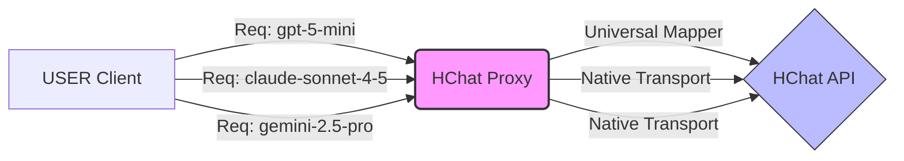

# 🌟 HChat Proxy User Guide

> **Unlock the full potential of HChat with a unified, developer-friendly proxy.**
> Seamlessly connect your favorite AI tools and SDKs to HChat's powerful LLM infrastructure.

---

## ⚡️ Quick Start

**단 3단계**로 HChat의 모든 모델을 사용할 준비가 끝납니다.

1.  **실행**: Windows 앱(`HChat Proxy.exe`) 또는 Docker 컨테이너를 실행하세요.
2.  **확인**: `http://localhost:11435` 주소로 실행 상태를 확인합니다.
3.  **연결**: 아래 설정을 사용하여 클라이언트를 연결하세요.

| 설정 항목    | 값                          | 설명                    |
| :----------- | :-------------------------- | :---------------------- |
| **Base URL** | `http://localhost:11435/v1` | Proxy의 통합 엔드포인트 |
| **API Key**  | `hk-...` (Your HChat Key)   | 기존 키 그대로 사용     |

---

## 🔌 Connection Magic

모든 코드는 **OpenAI 호환 방식**으로 작성하면 됩니다. HChat Proxy가 알아서 중계해 드립니다.

### 🐍 Python SDK

```python
from openai import OpenAI

client = OpenAI(
    base_url="http://localhost:11435/v1",
    api_key="YOUR_HCHAT_KEY"
)

# 🤖 GPT-5 (via Universal Route)
response = client.chat.completions.create(
    model="gpt-5-mini",
    messages=[{"role": "user", "content": "Hello!"}]
)

# 💎 Claude / Gemini (Native Pass-through)
# 모델 이름만 바꾸면 Proxy가 자동으로 라우팅합니다!
claude_res = client.chat.completions.create(
    model="claude-sonnet-4-5",
    messages=[{"role": "user", "content": "Hi Claude!"}]
)
```

### 📦 Node.js SDK

```javascript
import OpenAI from "openai";

const openai = new OpenAI({
  baseURL: "http://localhost:11435/v1",
  apiKey: "YOUR_HCHAT_KEY",
});

const stream = await openai.chat.completions.create({
  model: "gemini-2.5-pro",
  messages: [{ role: "user", content: "Tell me a story." }],
  stream: true,
});

for await (const chunk of stream) {
  process.stdout.write(chunk.choices[0]?.delta?.content || "");
}
```

### 🧠 Thinking Process (CoT)

OpenAI 호환 모드로 **Claude 3.7**이나 **Gemini 2.0** 같은 추론 모델을 사용할 경우, 모델의 사고 과정(Chain of Thought)은 **`<think>`** 태그에 감싸져 전달됩니다.

```txt
<think>
문제를 분석하고 있습니다...
1. 입력 데이터 확인
2. 논리적 추론 수행
</think>
여기에 최종 답변이 나옵니다.
```

---

## 💎 Native SDK Support

OpenAI 호환 방식 외에도, 각 제조사의 Native SDK를 직접 사용할 수 있습니다.

### 🧠 Anthropic (Claude) SDK

**주소(`base_url`)만 변경**하면 됩니다.

#### Python

```python
from anthropic import Anthropic

client = Anthropic(
    base_url="http://localhost:11435/v1",  # /v1/messages로 자동 매핑됨
    api_key="YOUR_HCHAT_KEY"
)

message = client.messages.create(
    model="claude-sonnet-4-5",
    max_tokens=1024,
    messages=[{"role": "user", "content": "Hello, Claude!"}]
)
print(message.content[0].text)
```

### ✨ Google (Gemini) GenAI SDK

Google 공식 SDK(`google-genai`)를 사용하여 Native 기능을 그대로 활용할 수 있습니다.

#### Python

```python
from google import genai

client = genai.Client(
    api_key="YOUR_HCHAT_KEY",
    http_options={'api_endpoint': 'http://localhost:11435/v1'}
)

# 1. Non-streaming
response = client.models.generate_content(
    model='gemini-2.0-flash',
    contents="Explain quantum physics"
)
print(response.text)

# 2. Streaming (New!)
response = client.models.generate_content_stream(
    model='gemini-2.0-flash',
    contents="Tell me a long story"
)
for chunk in response:
    print(chunk.text, end="")
```

---

## 🛠 Integration Recipes

유명한 AI 도구들과도 완벽하게 호환됩니다.

### 🖱️ Cursor / VSCode (GenAI Plugins)

Cursor 설정에서 `OpenAI Base URL`을 덮어쓰기만 하면 됩니다.

> [!TIP] > **Cursor Settings** -> **Models** -> **OpenAI**
>
> - **Base URL**: `http://localhost:11435/v1`
> - **API Key**: `YOUR_HCHAT_KEY`
> - **Model Name**: `gpt-5-mini` (Add manually)

### 🦜🔗 LangChain

```python
from langchain_openai import ChatOpenAI

llm = ChatOpenAI(
    base_url="http://localhost:11435/v1",
    api_key="YOUR_HCHAT_KEY",
    model="claude-sonnet-4-5"
)

llm.invoke("What is the capital of HChat?")
```

---

## 🧠 Smart Routing Architecture

HChat Proxy는 모델 이름을 보고 가장 적합한 경로로 요청을 전달합니다.



---

## ⚙️ Configuration (Port 변경)

기본 포트(`11435`)가 충돌하거나 변경하고 싶다면:

- **Windows 앱**: 트레이 아이콘 우클릭 > **Settings** > **Port** 값을 수정하고 저장하세요.
- **Docker**: `PORT` 환경변수와 `-p` 옵션을 변경하세요.
  ```bash
  # 예: 내부 3000번 포트로 변경하고 호스트 8080에 매핑
  docker run -p 8080:3000 -e PORT=3000 ...
  ```

---

## ❓ FAQ

<details>
<summary><strong>Q. Docker에서 localhost로 접속이 안 돼요!</strong></summary>

Docker 컨테이너 내부에서 호스트의 Proxy로 접속하려면 `host.docker.internal:11435`를 사용해야 할 수 있습니다. (Mac/Windows 기준)

</details>

<details>
<summary><strong>Q. 지원되는 모델 목록은 어디서 보나요?</strong></summary>

브라우저에서 `http://localhost:11435/v1/models` 로 접속하거나, 앱의 **Status Page**에서 확인할 수 있습니다.

</details>

---

> [!IMPORTANT] > **보안 주의사항**: Proxy는 로컬 환경(`localhost`)에서 실행되도록 설계되었습니다. 공용 네트워크에 포트를 노출하지 않도록 주의하세요.
