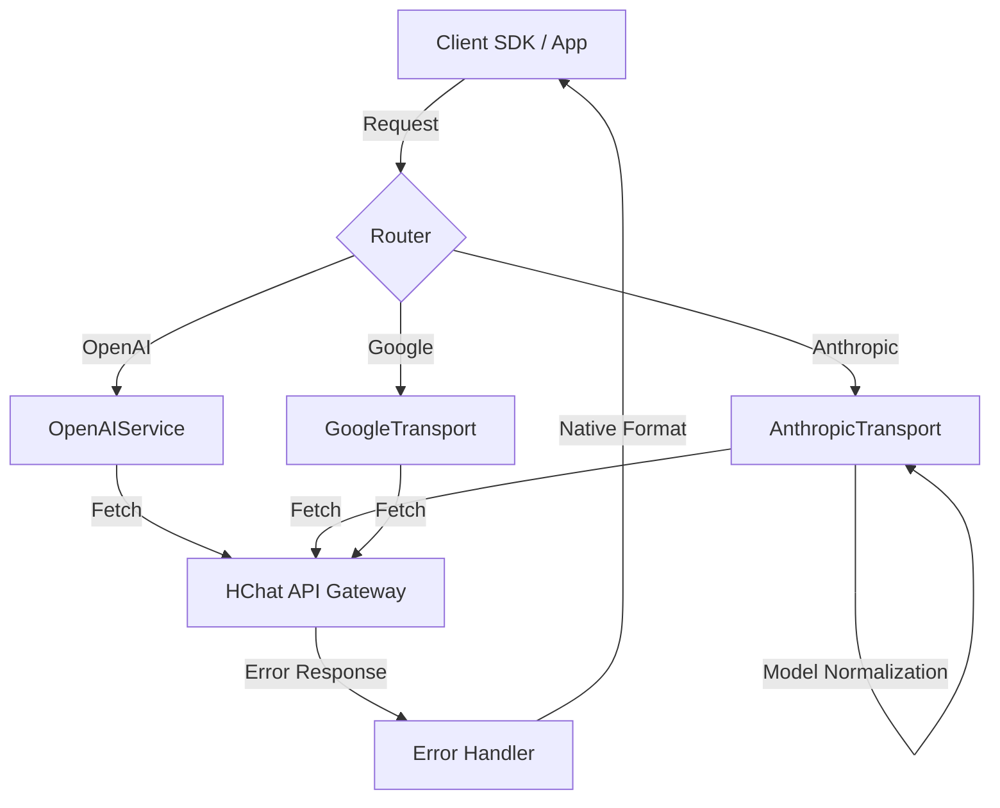

# HChat Proxy (v1.1.8)

HChat API Gateway를 위한 고성능 데스크톱(Electron) 및 서버(Docker) 프록시 애플리케이션입니다.
OpenAI, Anthropic, Google SDK와의 완벽한 호환성을 제공하며, 업스트림 API의 제약 사항을 자동으로 해결하는 지능형 전처기 로직을 포함합니다.

## ✨ 주요 기능

- **Unified OpenAI Interface**: `/v1/chat/completions`를 통해 모든 모델(GPT, Claude, Gemini) 통합 호출.
- **Native SDK Pass-through**:
  - **Anthropic**: Anthropic SDK를 그대로 사용하여 `/v1/messages` 경로로 프록시 가능.
  - **Google Gemini**: Gemini SDK를 사용하여 `/v1` 혹은 `/v1beta` 경로로 프록시 가능.
- **지능형 자동 정규화 (Auto-Normalization)**:
  - **Tool Sanitization**: 업스트림 API에서 오류를 유발하는 `tool_choice: { type: "auto" }` 객체 형식을 자동으로 감지하여 제거/정규화.
  - **Model Mapping**: Claude의 날짜 포함 모델명(예: `claude-3-5-sonnet-20240620`) 등을 HChat 호환 명칭으로 자동 변환.
- **Native Error Transparency**: 업스트림 서버 오류를 클라이언트 SDK가 이해할 수 있는 Anthropic/OpenAI 표준 JSON 포맷으로 실시간 변환하여 반환 (ZodError/Validation Error 방지).
- **강력한 진단 로그**: `DEBUG` 레벨 로그를 통해 요청 헤더, 바디, 업스트림 응답을 상세히 추적 가능.

## 🚀 설치 및 실행

### Windows 데스크톱 앱 (GUI)

시스템 트레이에서 실행되며 GUI 환경에서 API Key와 Base URL을 관리합니다.

1. **설치 및 빌드**:
   ```bash
   npm install
   npm run package
   ```
2. **실행**: `release/` 폴더의 `HChat Proxy Setup.exe`를 설치하거나 Portable 버전을 실행합니다.

## 🛠 아키텍처 및 라우팅

### 라우팅 테이블

| 목적             | 메서드 | 경로 패턴                 | 처리기      |
| :--------------- | :----- | :------------------------ | :---------- |
| OpenAI 통합      | POST   | `/v1/chat/completions`    | `openai`    |
| Anthropic Native | POST   | `/(v1/)?messages`         | `anthropic` |
| Google Native    | POST   | `/(v1\|v1beta)/models/.+` | `google`    |
| 모델 목록        | GET    | `/v1/models`              | `models`    |

### 아키텍처 흐름



## 📝 개발 및 기여

1. **의존성 설치**: `npm install`
2. **로컬 실행**: `npm start`
3. **버전 관리**: 개선된 로직 반영 후 `package.json` 버전 업데이트 필수.
