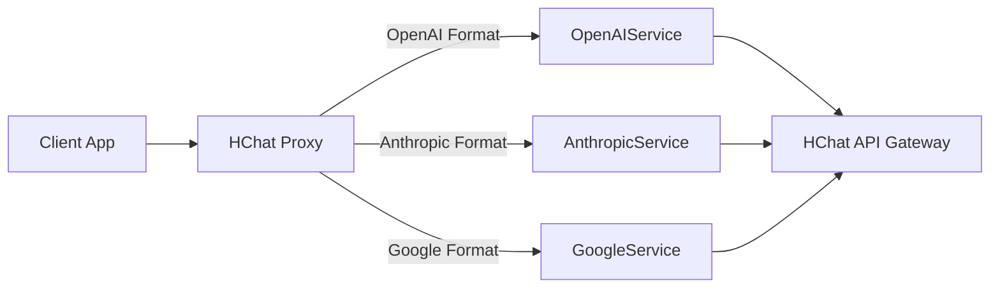

# HChat Proxy

HChat API Gateway를 위한 데스크톱(Electron) 및 서버(Docker) 프록시 애플리케이션입니다.
OpenAI SDK 호환 인터페이스를 제공하여 기존 애플리케이션을 HChat과 쉽게 연동할 수 있도록 돕습니다.

## ✨ 주요 기능

- **Unified OpenAI Support**: `/v1/chat/completions` 엔드포인트를 통해 OpenAI, Anthropic(Claude), Google(Gemini) 모델을 모두 지원합니다.
- **Native Providers**:
  - OpenAI (`gpt-4`, `gpt-3.5-turbo` 등) - HChat Mapper 사용
  - Anthropic (`claude-3-opus`, `sonnet` 등) - Native Pass-through
  - Google (`gemini-pro` 등) - Native Pass-through
- **배포 유연성**: 윈도우 데스크톱 앱과 Docker 서버 두 가지 모드로 배포 가능합니다.
- **보안**: API Key 관리 및 API Base URL 설정 기능.

## 🚀 설치 및 실행

### 방법 1: Windows 데스크톱 앱 (GUI)

시스템 트레이에서 실행되며 설정을 GUI로 관리할 수 있습니다.

1.  **설치 및 빌드**:
    ```bash
    npm install
    npm run package
    ```
2.  **실행**:
    `release/` 폴더에 생성된 설치 파일(`setup.exe`) 또는 포터블 실행 파일을 사용합니다.

### 방법 2: Docker 서버 (Headless)

GUI 없이 백그라운드 서비스로 실행됩니다.

1.  **Docker 빌드**:
    ```bash
    docker build -t hchat-proxy .
    ```
2.  **실행**:
    ```bash
    docker run -d \
      -p 11435:11435 \
      -e HCHAT_API_KEY="your-api-key-here" \
      hchat-proxy
    ```

## 🛠 아키텍처



### 디렉토리 구조

- `src/proxy.ts`: 핵심 프록시 서버 로직 (Node.js/Electron 공용)
- `src/server.ts`: Docker/Node.js 전용 엔트리포인트
- `src/main.ts`: Electron 전용 엔트리포인트
- `src/client/services`:
  - `OpenAIService`: OpenAI 호환 처리
  - `AnthropicService`: Claude Native 처리
  - `GoogleService`: Gemini Native 처리

## 📝 개발 환경 설정

1.  Node.js 18+ 설치
2.  의존성 설치: `npm install`
3.  개발 모드 실행: `npm start`
4.  서버 모드 테스트: `npm run start:server`
