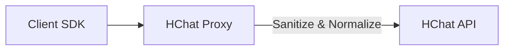

# HChat Proxy (v1.1.8)

HChat API Gateway를 위한 고성능 데스크톱(Electron) 및 서버(Docker) 프록시 애플리케이션입니다.
OpenAI, Anthropic, Google SDK와의 완벽한 호환성을 제공하며, 업스트림 API의 제약 사항을 자동으로 해결하는 지능형 전처기 로직을 포함합니다.

## ✨ 주요 기능

- **Unified OpenAI Interface**: `/v1/chat/completions`를 통해 모든 모델(GPT, Claude, Gemini) 통합 호출.
- **Native SDK Pass-through**:
  - **Anthropic**: Anthropic SDK를 그대로 사용하여 `/v1/messages` 경로로 프록시 가능.
  - **Google Gemini**: Gemini SDK를 사용하여 `/v1` 혹은 `/v1beta` 경로로 프록시 가능.
- **지능형 자동 정규화 (Auto-Normalization)**:
  - **Tool Sanitization**: 업스트림 API에서 오류를 유발하는 `tool_choice: { type: "auto" }` 객체 형식을 자동으로 감지하여 제거/정규화.
  - **Model Mapping**: Claude의 날짜 포함 모델명(예: `claude-3-5-sonnet-20240620`) 등을 HChat 호환 명칭으로 자동 변환.
- **Native Error Transparency**: 업스트림 서버 오류를 클라이언트 SDK가 이해할 수 있는 Anthropic/OpenAI 표준 JSON 포맷으로 실시간 변환하여 반환 (ZodError/Validation Error 방지).

## 💡 사용 방법 (Usage)

### 1. OpenAI SDK (Unified & GPT)

모든 모델(GPT, Claude, Gemini)을 OpenAI 호환 방식으로 사용할 수 있습니다.

```python
from openai import OpenAI
client = OpenAI(base_url="http://localhost:11435/v1", api_key="hk-...")

# 어떠한 모델도 OpenAI 방식으로 호출 가능
response = client.chat.completions.create(
    model="gpt-5-mini", # 또는 claude-3-7-sonnet 등
    messages=[{"role": "user", "content": "Hello!"}]
)
```

### 2. Anthropic SDK (Claude)

Anthropic 공식 SDK를 그대로 사용할 수 있으며, 프록시가 자동으로 호환성을 확보합니다.

```python
from anthropic import Anthropic
client = Anthropic(base_url="http://localhost:11435/v1", api_key="hk-...")

# 프록시가 내부적으로 tool_choice 필드 제거 및 헤더/URL 맵핑을 수행합니다.
message = client.messages.create(
    model="claude-3-7-sonnet",
    max_tokens=1024,
    messages=[{"role": "user", "content": "Hi Claude!"}]
)
```

### 3. Google GenAI SDK (Gemini)

Google의 최신 Generative AI SDK를 사용하여 Gemini 기능을 활용할 수 있습니다.

```python
from google import genai
client = genai.Client(api_key="hk-...", http_options={'api_endpoint': 'http://localhost:11435/v1'})

# /v1 및 /v1beta 경로를 모두 지원하여 최신 SDK와 완벽히 호환됩니다.
response = client.models.generate_content(
    model='gemini-2.0-flash',
    contents="Explain quantum physics"
)
```

## 🚀 설치 및 실행

### Windows 데스크톱 앱 (GUI)

1. **설치**: `release/` 폴더에서 `HChat Proxy Setup.exe`를 실행합니다.
2. **설정**: 시스템 트레이 아이콘을 통해 API Key 및 Port를 설정합니다.

### Docker 서버 (Headless)

```bash
docker run -d -p 11435:11435 -e HCHAT_API_KEY="your-key" rewq114/hchat-proxy:latest
```

## 🛠 아키텍처 및 라우팅

| 목적             | 메서드 | 경로 패턴                 | 처리기      |
| :--------------- | :----- | :------------------------ | :---------- |
| OpenAI 통합      | POST   | `/v1/chat/completions`    | `openai`    |
| Anthropic Native | POST   | `/(v1/)?messages`         | `anthropic` |
| Google Native    | POST   | `/(v1\|v1beta)/models/.+` | `google`    |



## 📝 개발 가이드

- 의존성 설치: `npm install`
- 개발 모드 실행: `npm start`
- 테스트 실행: `python scripts/test_anthropic_suite.py`
